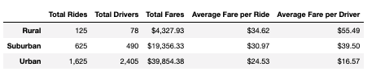
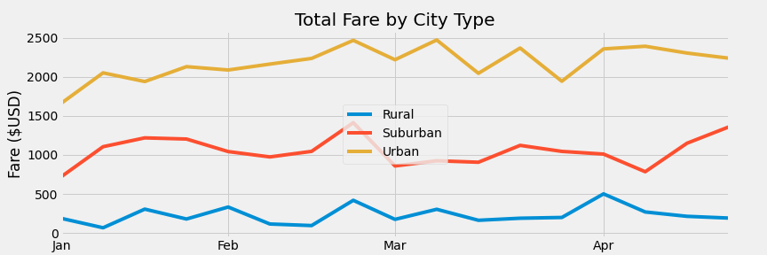

# PyBer_Analysis

## Overview
The client would like to see an analysis of the ride sharing data grouped by rural, suburban, and urban city types.

## Results
Below is a summary of the data broken down by rural, suburban, or urban city types.

- Urban cities have 13 times the rides as rural cities and over 2.6 times the rides as suburban cities.
- Urban cities have over 30 times the drivers as rural cities and 5 times the drivers as suburban cities. 
- Urban cities make up 62% of the total fares.
- Rural cities have the highest average fare with as average of $34.62, which is 12% higher than suburban cities and 41% higher than urban cities.
- Rural cities also have the highest average fare per driver with as average of $55.49, which is 40% higher than suburban cities and 248% higher than urban cities.

The chart below shows the total fares for each city type by week from January through April 2019.

- The third week of February shows an increase of fares for all city types. 
- The last week of April shows a steep rise in suburban fares but a decrease in urban and rural fares. 
- Over the entire timespan, urban fares were higher than suburban and suburban fares were higher than rural. 

## Summary

Per the analysis, here are three recommendations for addressing disparities amoung the city types:

1. The avarege costs per ride and per driver in rural areas is much higher than suburban and urban fares. Therefore, if you could discount the fares in rural areas you may see an increase in number of rides and an increase in total fare revenue.
2. The same goes for suburban cities. Therefore, by discounting the fares in suburban cities you may see an increase in number of rides and an increase in total fare revenue.
3. With the average costs per ride and driver in urban areas being much smaller than suburban and rural fares, you could try increasing the fares for additional revenue assuming the demand will remain even with increased prices. 